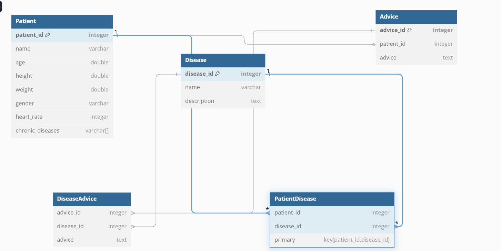

# Health Track System

Health Track is a CRUD (Create, Read, Update, Delete) system designed to help users monitor their health parameters in alignment with the World Health Organization (WHO) guidelines. Users can input health-related data such as age, weight, height, heart rate, and chronic diseases. The system provides personalized advice based on WHO standards.

## Features
1. **Track Health Data**  
   Input and manage important health parameters such as **age**, **weight**, **height**, **heart rate**, and chronic diseases. The system dynamically calculates and displays relevant health information based on user input.

2. **Personalized Health Dashboard**  
   Display a **personalized health summary** that includes details like the user's **name**, **age**, **height**, **weight**, **heart rate**, and **daily water intake recommendations**.

3. **Disease Advice Generation**  
   Get **tailored health advice** based on selected chronic diseases, such as **diabetes**, **Alzheimer's disease**, and **ADHD**. The system provides specific guidance to manage each disease, including lifestyle changes, medications, and other recommendations.

4. **BMI and Body Fat Percentage Analysis**  
   Calculate and **analyze BMI** (Body Mass Index) to provide users with insights into their overall health. Additionally, the app calculates and explains the **body fat percentage**, helping users understand their body composition.

5. **Heart Rate Monitoring**  
   Receive **heart rate analysis** to understand cardiovascular health. This feature helps users monitor their heart rate and assess how it relates to their fitness and well-being.

6. **Chronic Disease Tracking**  
   Track **chronic diseases** and manage them effectively by receiving relevant advice on how to live with and manage conditions like diabetes, Alzheimer's, and ADHD.

7. **Water Intake Recommendations**  
   The system suggests **optimal water intake** based on user data, offering both the recommended amount in liters and the equivalent in cups to ensure hydration.

8. **Interactive UI**  
   The app features an **interactive user interface** with buttons for generating advice, selecting chronic diseases, and navigating between various sections, such as the health profile and disease-specific advice.

9. **Back Navigation**  
    Users can **navigate back** to previous views, providing easy access to different sections of the application.

10. **WHO Guidelines Integration**  
    The app integrates reliable recommendations based on **WHO (World Health Organization) guidelines**, ensuring that users receive up-to-date and evidence-based health advice.

11. **Error Handling and User Feedback**  
    The application provides **error handling** mechanisms and **user feedback** through informative dialog boxes in case of data input errors or other issues, guiding users through the process.

## Team Members
- **Member 1**: Kozhomberdiev Kalys 
- **Member 2**: Akylbekova Rozalina
- **Member 3**: Nazarova Ayana

## Roles of Group Members
- **Kozhomberdiev Kalys** - VFX design and implementation of user interface
- **Akylbekova Rozalina** - DataBase structure and its CRUD operations
- **Nazarova Ayana** - Patient logic

## Screenshots

## UML Class Diagram
The following UML Class Diagram illustrates the system’s structure:

## Weekly Meeting Documentation
Weekly meeting notes and discussions are documented in a Google Doc. Summaries of each meeting are uploaded to the GitHub repository under 
[Weekly Meeting Document](https://docs.google.com/document/d/1_PvYmWlIDevj57fQV20lrFTZC6dWS6nIS1UiOpQGHo4/edit?usp=sharing).

## Commit History
A detailed commit history, starting at least three weeks before the submission date, can be reviewed in the GitHub repository. Each commit includes a meaningful message describing the changes made.

## Submission
- The GitHub repository link:
[Health Track System Repository](https://github.com/rosszzalina/Health-Trackerr)

- Presentation link:
[Presentation](https://www.canva.com/design/DAGZwDL7ywI/torTlD1cskQYJF0zGky_LQ/view?utm_content=DAGZwDL7ywI&utm_campaign=designshare&utm_medium=link2&utm_source=uniquelinks&utlId=h39e5718896)

- JAR File:

---

For additional information on WHO guidelines and health recommendations, visit the [WHO Website](https://www.who.int).
